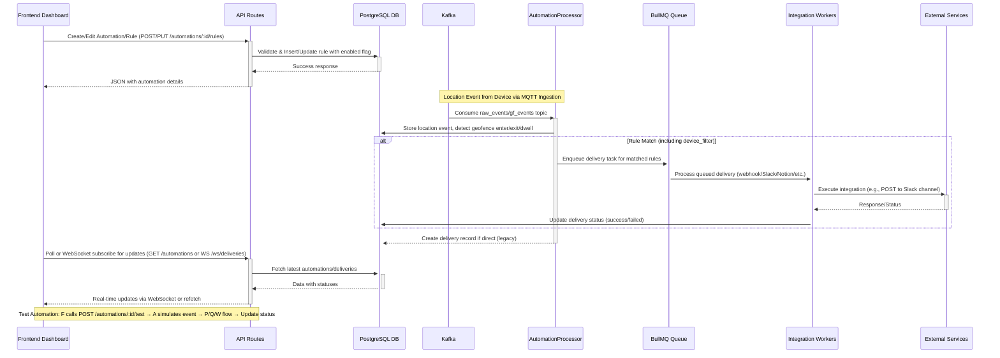

# Frontend Automations Integration Plan

## 1. Architectural Overview

### Data Flow Diagram
The integration aims to enable seamless creation, monitoring, and real-time updates of automations from the frontend, syncing with backend processing via API, Kafka, and queues. The enhanced flow incorporates queuing for all integration kinds and WebSockets for live updates.

### Component Hierarchy (Frontend)
Based on existing structure in apps/dashboard/src:
- **Root Layout** ([`layout.tsx`](src/app/layout.tsx)): Wraps with QueryProvider, AuthContext, SidebarContext.
  - **Automations Page** ([`page.tsx`](src/app/automations/page.tsx)): Main view with stats cards, search/filter, automations table (columns: name, trigger, status, actions: toggle/test/edit/delete). Uses inline modal for create/edit (to be replaced). Hooks: useAutomations for list, useUpdateAutomation for toggle/delete.
    - **Automation Table**: Renders rows with conditional rendering for active status.
    - **Inline Create/Edit Modal**: Form fields (name, trigger, geofence select - hardcoded, device, integration kind, dwell time). Placeholder submission.
  - **AutomationRuleModal** ([`components/AutomationRuleModal.tsx`](src/components/AutomationRuleModal.tsx)): Standalone modal for rule CRUD, integrated via button actions. Form: name, geofence (useGeofences hook), device (useDevices), triggers (checkboxes: enter/exit/dwell), dwell seconds, enabled toggle. Mutations: useCreateAutomationRule, useUpdateAutomationRule. Validation: required fields, conditional dwell.
    - **Hooks Layer**: useApi.ts for queries/mutations (React Query), services/api.ts for fetch calls to backend endpoints.
- **Real-time Integration**: New WebSocket component in RealTimeMonitor.tsx to subscribe to delivery updates, refreshing table.
- **Shared**: Header.tsx, Sidebar.tsx for navigation; LoadingSpinner.tsx for states.

This hierarchy ensures modular UI: Page orchestrates list/actions, Modal handles forms, Hooks abstract API.

## 2. Backend Changes Needed

To support robust frontend integration, backend must ensure reliability, real-time feedback, and full integration support. Changes focus on queuing, full implementations, and alignments.

- **API Enhancements** (apps/api/src/routes/automations.ts):
  - Add WebSocket endpoint (e.g., /ws/automations) for real-time delivery status pushes using socket.io or ws library. Broadcast updates on delivery status changes.
  - Implement test endpoint (POST /automations/:id/test): Simulate a geofence event for the automation, trigger rule matching and delivery, return simulated status.
  - Align fields: Change frontend-facing responses to use 'enabled' instead of 'is_active'; update schemas to enforce consistency.
  - Add delivery status querying: GET /automations/:id/deliveries for paginated list with filters (status, date).

- **Worker Queuing and Full Integrations** (apps/automation-workers/src):
  - Modify AutomationProcessor.ts: Instead of direct webhook execution, create delivery record and enqueue BullMQ job for all kinds (not just webhook). Use device_filter logic (match device_id against rule's device_filter).
  - Enhance WebhookWorker.ts: Implement full handlers for all kinds:
    - Slack: Use @slack/web-api to post to channel with formatted message (event details).
    - Notion: Use Notion API client to create page in database_id with properties from event (e.g., device name, timestamp).
    - Sheets: Use Google Sheets API to append row with event data (authenticate via service account).
    - WhatsApp: Use Twilio or official API to send text message with template.
    - Webhook: Existing, but add HMAC signature verification.
  - Add retry logic: BullMQ retries (e.g., 3 attempts) for failed deliveries; update status to 'failed' on exhaustion, log errors.
  - Dwell validation: Already in Processor; ensure min_dwell_seconds check queries DB for recent enter/exit.

- **Database and Middleware**:
  - Add 'deliveries' table fields if needed (e.g., retry_count, last_error).
  - Enforce device_filter in rule matching (current stub always true).
  - Use transactions for delivery creation/enqueue to prevent partial states.

These changes prevent blocking in Processor and enable scalability for multiple integrations.

## 3. Frontend Changes

Frontend must provide intuitive UI for config, real-time monitoring, and error resilience, integrating existing components fully.

- **UI/UX for Config Forms** (apps/dashboard/src/app/automations/page.tsx and components/AutomationRuleModal.tsx):
  - Replace inline modal in page.tsx with AutomationRuleModal for consistency; trigger via create/edit buttons.
  - Add conditional config fields per integration kind: E.g., for 'webhook' - URL input, headers JSON editor; for 'slack' - channel select, bot token; for 'notion' - database_id, auth token; similar for sheets (spreadsheet_id), whatsapp (phone number). Use dynamic forms with React Hook Form or similar for validation.
  - Dynamic selects: Use useGeofences, useDevices hooks for options; fetch automations for rule parent.
  - Dwell time: Conditional input for 'dwell' trigger, with validation (>0 seconds).

- **Integration of Modals and Hooks**:
  - Update useAutomations hook to include delivery stats (e.g., recent successes/failures).
  - Add useWebSocket hook for real-time: Connect to backend WS, subscribe to account-specific deliveries, update local cache via React Query invalidation.
  - Actions: Toggle enabled (map to backend 'enabled'), test button calls test endpoint and shows progress toast.

- **Error Handling and UX**:
  - Replace alerts with toast notifications (e.g., react-hot-toast) for success/error (e.g., "Delivery failed: Invalid URL").
  - Loading states: Spinner during mutations/refetches.
  - Table enhancements: Add delivery column (last status), filter by integration kind.

Data flow: Form submission → Hook mutation → API → Backend processing → WS update → UI refresh.

## 4. Field Alignments and Best Practices

- **Consistent Naming**: Frontend uses 'is_active'; backend 'enabled'. Align to 'enabled' in all schemas/responses. Update shared types in packages/shared/src/types.ts (e.g., Automation type with enabled: boolean).
- **Validation**: Frontend: Client-side (e.g., dwell >0, required config per kind). Backend: Zod schemas for configs (e.g., webhook.url as string, notion.database_id as uuid). Handle mismatches like trigger types (enter/exit/dwell).
- **Best Practices**: Use TypeScript consistently; error messages user-friendly (no stack traces); security (e.g., mask tokens in UI); accessibility (ARIA labels on modals); performance (debounce search, virtualize table if large lists).
- **Security**: Validate configs server-side (e.g., URL whitelisting); use encryption for sensitive fields like tokens.

## 5. Testing and Deployment Considerations

- **Testing**:
  - Unit: Test hooks (e.g., useAutomations mock API), components (form validation), worker handlers (mock external APIs).
  - Integration: E2E with Playwright/Cypress: Create rule → Simulate MQTT event → Verify delivery in external mock → Check UI update.
  - End-to-End Flow: Mock Kafka event → Queue → Worker execution → WS push to frontend.
  - Coverage: Aim 80%+ for new code; test edge cases (failed deliveries, invalid configs, dwell timeouts).

- **Deployment**:
  - Docker: Update compose files for workers (scale BullMQ Redis); add WS support in API Dockerfile.
  - CI/CD: GitHub Actions for tests/migrations on PR; deploy to staging/prod with env vars for integrations (e.g., API keys).
  - Monitoring: Prometheus/Grafana for queue metrics, delivery success rates; log errors to Sentry.
  - Scalability: Partition Kafka topics by account; horizontal scale workers.
  - Documentation: Update README.md with setup for integrations (e.g., env vars for Slack token); API docs with Swagger.

## Prioritized Steps for Implementation
Implementation should start with backend stability to avoid breaking existing webhook flow, then frontend enhancements. Order:

1. Align fields (enabled) across backend schemas and shared types.
2. Implement device_filter logic in AutomationProcessor.ts.
3. Switch Processor to queue all deliveries via BullMQ, starting with webhook.
4. Implement full integration handlers in WebhookWorker.ts (one kind at a time: Slack, then Notion, etc.).
5. Add WebSocket endpoint in API for real-time updates.
6. Add test endpoint in API routes.
7. Update frontend hooks to use 'enabled' and fetch dynamic options.
8. Integrate AutomationRuleModal into automations page.tsx, add conditional config forms.
9. Implement WebSocket client in frontend for real-time table updates.
10. Add comprehensive error handling (toasts, validation).
11. Write unit/integration tests for new features.
12. Update deployment configs and documentation.